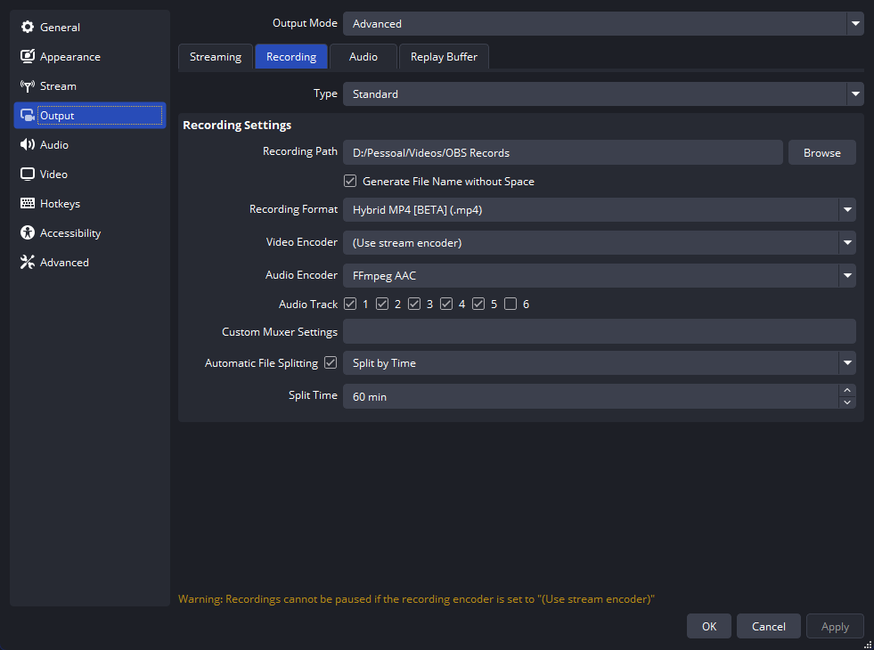

# OBS Settings

A guide straight to the point with some settings to use OBS for **Streaming** and/or **Recording** and also **clipping locally**.

Any optimized way to do a step will be take into account, stop spending a lot of **CPU**, **RAM** and mainly **VRAM**!! Save your resources.

## OBS Portable Mode

There are 2 ways of using OBS in portable mode, this is essential, as you don't need to backup from an external folder.

- **Permanent (recommended)**: go to `C:\Program Files\obs-studio` or your current OBS folder, and create a file `portable_mode.txt`, this makes portable mode permanent, I've only learnt about this after joining the EnhancedBroadcast beta. If you have any settings already move from `%appdata%/obs-studio` to within the OBS folder `C:\Program Files\obs-studio\config\obs-studio` or your relative location.

- **Temporary**: use a shortcut and add the parameters to the end of the launch parameters `--portable` or `-p`.

**More parameters**: <https://obsproject.com/kb/launch-parameters>
**More info about Portable Mode**: <https://obsproject.com/kb/portable-mode>

## Run as Administrator

I still don't know the GOOD reasons exactly, but running OBS as administrator will let you setup your stuff without hassle and may give some stability improvements (?).

## Settings Guide

### ⚙️ General

1. **Language**: here you want to set to **English** to simplify the understanding, but can go back to your language after that.
2. **Source Alignment Snapping**: make sure to enable all of the boxes of this section, and set the **sensitivity** to **10.0**.

### 📡 Stream

1. Choose the platform you want to stream and search the **platform streaming settings** they recommend, this settings guide will follow with "YouTube - RTMPS" as it contains powerful codecs support.
2. Now DON'T connect your account, _only provide the stream key_, because connecting it will use a LOT of RAM and store browser cache in your OBS.
3. Always check "**Ignore streaming service setting recommendations**", trust me, this'll be useful as we want max quality and want to save resources at the same time.
4. After this, press OK and disable any new browser **dock** after enabling this option.

**YouTube only**: even if you don't have a 1440p+ monitor, create a stream key to use **1440p60**. It'll change their encoder from `avc1` (H264) to `vp09` (VP9) on _Stats for Nerds_.

### 📹 Output

Set the **Output Mode** to `Advanced`, so you can see all the options.

#### Streaming

**Remember:** make sure your **_GPU drivers_** are up to date.

> [!CAUTION]
> ALWAYS prefer using _hardware encoder_ over _software encoder_ when possible.

The **Video Encoder** quality order will usually be this way: **AV1** > **HEVC** > **H.264**

On **YouTube**, based on their _[streaming settings](https://support.google.com/youtube/answer/2853702)_, **AV1** and **HEVC** can go up to `10.000kbps` of Bitrate and **H.264** can go up to `12.000kbps`.

On **Twitch** you can bypass the `6000kbps` Bitrate and go up to `8000kbps` for some people, test it first.

<ins>Use the following settings if you find yourself in **ONE** of these situations:</ins>

1. Your Graphics Card has 8GB or less of VRAM;
   - This only applies if you are streaming GAMES;
2. Your graphics card **DOESN'T** have a dedicated chip just for encoding, sharing 3D with video encoding/decoding;
3. You are doing **multi-stream** with the same GPU (will use 2 or more encoder sessions);

**_VRAM USAGE:_** _70MB per encoding session_

<ins>Otherwise you can push a little more from OBS settings:</ins>

**_VRAM USAGE:_** _269MB per encoding session_

If you want to Stream in HDR, AV1 is not currently supported.

Always use the GPU encoder if possible! But if you can only encode from your CPU, here's some settings.

If it's stuttering or using too much of your CPU (20%+), I suggest using a even faster **CPU Usage Preset**, and as a last resort decreasing the **Profile** option, but it'll hurt the quality.

#### Recording

If you are **recording** move your files away from your _system disk_ and _game disk_ if possible!

You can set your recording settings manually if you want, but know that by doing that you will use another _encoding session_ on your GPU, using more from the encoder chip and VRAM, if you need to change, go ahead.

#### Audio

Set the **Audio Bitrate** to **320kbps** in every track, it'll sound a lot cleaner, and give more clarity to your voice.

Of course the tracks will vary if you use separate audio apps for more than 1 track. If you just stream, the **Track 1** will matter for all occasions and the **Track 2** for Twitch will matter.

For recording AND editing, if you want a good setup, here's my suggestion:

- **Track 1**: _Downmix_ (merge all sounds together)
- **Track 2**: _Game_ (or your program, only send 1 specific recurring audio to this track)
- **Track 3**: _Mic_ (your microphone audio)
- **Track 4**: _Discord_ (control the audio of your fellas)
- **Track 5**: _Browser/Player_ (focused on music only)

#### Replay Buffer

Enable if you want to clip locally, know that it'll use the same path as recording and the same settings.

- **Maximum Replay time**: 31s to approximate to ~30s.
- If you want to open OBS and start clipping (will CONSUME VRAM) add a launcher parameter to the shortcut: `--startreplaybuffer`.

Recording first as you can exceed any limit imposed by any platform, but be careful, as the file size may increase a LOT.

Sorry because I only have a 1080p monitor, so ONLY the bitrate may differ and you'll require more testing.

### 🔊 Audio

1. **Sample Rate**: This will depend on your audio setup, but generally is 48KHz. Remember to check your system's sound panel and make every device the same!

#### Global Audio Devices

Disable all audios from **Desktop** and **Microphones**. Create a Scene only for **audio management**, and import it to the others as needed.

### 🖥️ Video

If you have a dedicated GPU, just set it to the max resolution on **Base (Canvas) Resolution** and **Output (Scaled) Resolution** and use 60FPS.

### ⌨️ Hotkeys

Always have keys to mute **yourself** and **Discord**. If your keyboard have a numpad, make good use of it, now it is its time to shine. Use `Alt + Num 1 to 9` to change scenes, for other keys combinations always use `ALT` first, it won't conflict with most programs.

What I'm Using

|       Section        |                   Name | Hotkey          |
| :------------------: | ---------------------: | :-------------- |
|    **(General)**     |      Stop Streaming \* | Alt + End       |
|                      |     Start Recording \* | Alt + Page Down |
|                      |      Stop Recording \* | Alt + Page Down |
|                      |     Pause Recording \* | Alt + ]         |
|                      |   Unpause Recording \* | Alt + ]         |
|                      | Start Replay Buffer \* | Alt + /         |
|                      | Start Replay Buffer \* | Alt + /         |
|                      |   Screenshot Output \* | Alt + F12       |
|  **Replay Buffer**   |         Save Replay \* | Alt + .         |
|                      |         Save Replay \* | Alt + C         |
|     **Scene 1**      |        Switch to scene | Alt + Num 1     |
|     **Scene 2**      |        Switch to scene | Alt + Num 2     |
|     **Scene 3**      |        Switch to scene | Alt + Num 3     |
|     **Scene 4**      |        Switch to scene | Alt + Num 4     |
| **Stream Starting**  |        Switch to scene | Alt + Num 8     |
|  **Stream Ending**   |        Switch to scene | Alt + Num 9     |
|   **A - Discord**    |                Mute \* | Alt + Num ,     |
|                      |              Unmute \* | Alt + Num ,     |
|     **A - Mic**      |                Mute \* | Alt + Num 0     |
|                      |              Unmute \* | Alt + Num 0     |
| **G - Game Capture** |                Mute \* | Alt + M         |
|                      |              Unmute \* | Alt + M         |

### 🛠️ Advanced

#### Video

For SDR content you **don't need** to change anything, but for HDR the **Color Format** will be set to `P010 (10-bit, 4:2:0, 2 planes)` and the **Color Space** will be set to `Rec .2100 (PQ)`.

#### Network

Check these boxes:

1. Enable network optimizations
2. Enable TCP Pacing

#### Sources

If unchecked and you have a **dedicated GPU**, check `Enable Browser Source Hardware Acceleration` or else it will stutter.

## The End

That's all folks! Hope this helps someone and improve your video/stream quality, not every tip is here yet because this takes some time to learn and note, but I can assure you this is mostly everything I've learnt from some trials and errors.
